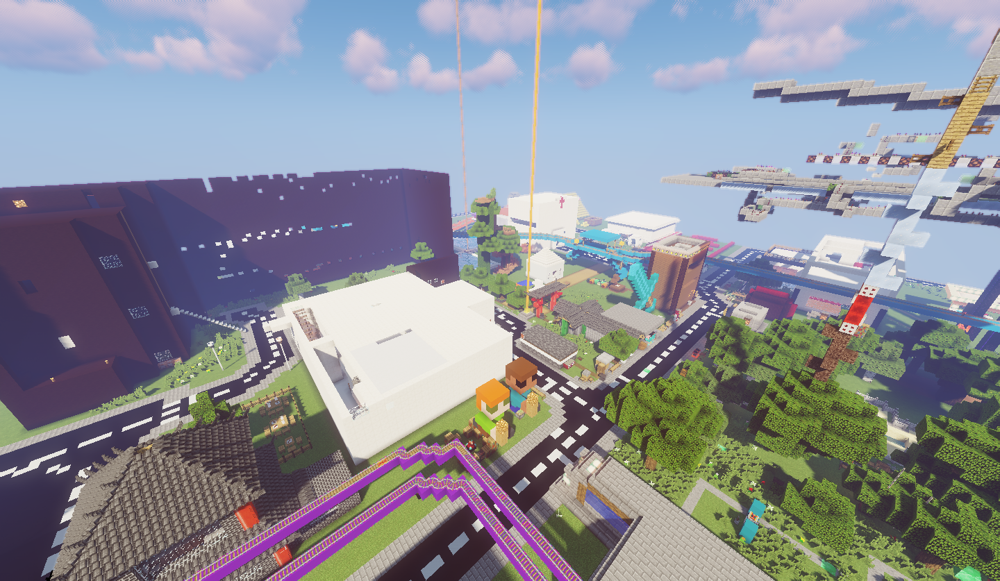
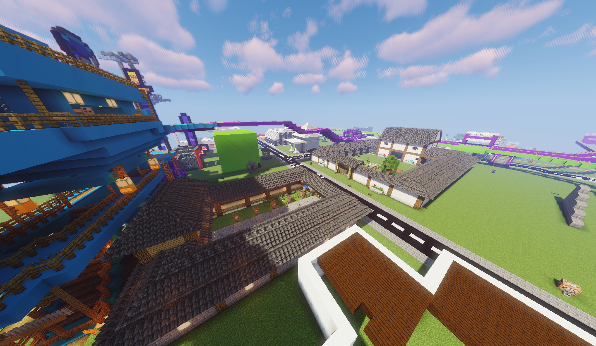
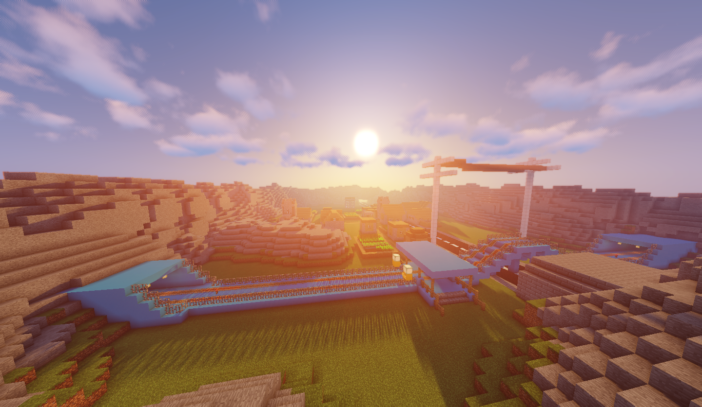

# Minecraft 1.12.2 长生服

## 📜 服务器简介

**长生服**是一个致力于提供纯净、稳定、友好的 Minecraft 1.12.2 建筑体验的服务器，最早于2022年8月5日开服。我们保留了 Minecraft 最经典版本的纯粹玩法，同时添加了必要的优化以提升游戏体验。

在这里，你可以自由建造，展示你的创意，与其他玩家交流互动，参与各种有趣的活动。我们的管理团队致力于打造一个公平、和谐、快乐的游戏环境。

无论你是新手还是老玩家，都能在长生服找到属于自己的快乐。加入我们，一起创建属于我们的 Minecraft 世界！

## ✨ 服务器特色

- **纯净生存体验**：保留 Minecraft 1.12.2 原版玩法，让你感受最纯粹的游戏乐趣
- **稳定运行**：服务器采用高性能配置，确保流畅的游戏体验
- **友好社区**：欢迎各类玩家，营造和谐互助的游戏氛围
- **自由建筑**：发挥你的创意，建造属于自己的理想家园
- **定期活动**：举办各类有趣的活动，增加游戏趣味性

## 🎮 如何加入

1. 下载 Minecraft 1.12.2 版本客户端
2. 添加服务器 IP（见[网站主页](/index.html)。）
3. 加入服务器，开始你的冒险之旅！

## 👥 管理团队

### 腐竹

>**华夫饼**
>
>华夫huanly
>
>[bilibili主页](https://space.bilibili.com/1728741267/)
>
>

### 管理员

>***daxiangz3***
>
>坚持梦想的象
>
>[bilibili主页](https://space.bilibili.com/1848005406)
>
>

>***SeicatNotCat***
>
>[bilibili主页](https://space.bilibili.com/630284239)
>
>

>***天蝎***
>
>天awa蝎
>
>[bilibili主页](https://space.bilibili.com/3493125018356416)
>
>

>***awa***
>
>欸嘿得囊打呦(awa)
>
>

## 📝 服务器规则

为了维护良好的游戏环境，请所有玩家遵守以下规则：

1. 禁止使用作弊模组和插件
2. 禁止恶意破坏他人建筑
3. 禁止偷窃他人财物
4. 禁止辱骂和骚扰其他玩家
5. 禁止传播不良信息
6. 请合理利用服务器资源

详细规则请查看[服务器规则页面](server-rule/index.html)。

## 📷 游戏截图

查看更多截图，请访问[照片墙](photos/index.html)。

## 📢 最新公告

请关注我们的[最新公告](notice/index.html)，获取服务器的最新动态和活动信息。

## 💬 联系我们

- 加入我们的QQ交流群（详见网站主页）
- 关注管理员的B站主页，获取更多服务器相关内容

## 🎉 加入我们

无论你是热爱建筑、喜欢探索，还是想结交新朋友，长生服都欢迎你的加入！让我们一起在这个充满创造力的世界里，留下属于我们的精彩回忆！

> 最后更新时间：2024年6月28日
